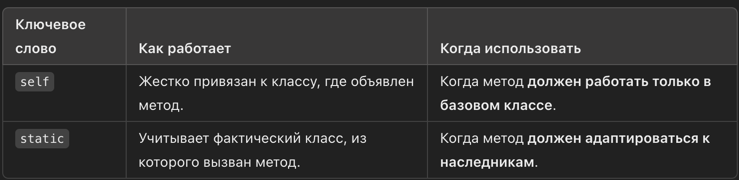
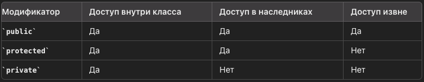
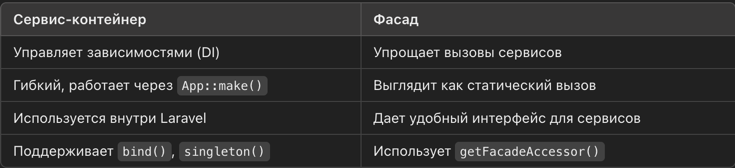

# php-interview

## Оглавление

- [PHP-FPM](#PHP-FPM)
- [OPCACHE](#OPCACHE)
- [Namespace](#Namespace)
- [OOP](#OOP)
- [Позднее статическое связывание](#Позднее-статическое-связывание)
- [Разница между this и self](#this-self)
- [Паттерны](#Patterns)
- [PHP](#PHP)
- [PHP Обновлении](#PHP-Versions)
- [Трейты](#Traits)
- [Абстрактный класс и интерфейс](#Абстрактный-класс-и-интерфейс)
- [SOLID](#SOLID)
- [Dependency Injection (DI) и Dependency Inversion Principle (DIP)](#Dependency-Injection-и-Dependency-Inversion-Principle)
- [KISS](#KISS)
- [DRY](#DRY)
- [Singleton](#Singleton)
- [Индексы](#Индексы)
- [Нормализация](#Нормализация)
- [Транзакция](#Транзакция)
- [ACID](#ACID)
- [Phantom Read](#Phantom-Read)
- [WHERE и HAVING](#WHERE-и-HAVING)
- [Redis](#Redis)
- [Модификатора доступа](#Модификатора-доступа)
- [Замыкания (closures)](#Замыкания-closures)
- [Магические методы](#Магические-методы)
- [PSR](#PSR)
- [Анонимные функции](#Анонимные-функции)
- [Сервис-контейнер и Фасад](#Сервис-контейнер-и-Фасад)
- [Cервис провайдер](#Cервис-провайдер)
- [RabbitMQ](#RabbitMQ)
- [генераторы](#генераторы)
- [Дизайн паттерн](#Дизайн-паттерн)
- [CICD](#CICD)
- [Psalm](#Psalm)
- [PHPCS](#PHPCS)
- [PBPCBF](#PBPCBF)
- [Рефлексия](#Рефлексия)
- [Композиция](#Композиция)
- [Дополнить](#Дополнить)

## PHP-FPM

PHP-FPM (FastCGI Process Manager)
PHP-FPM (FastCGI Process Manager) — это альтернативный способ обработки PHP-запросов через FastCGI, который значительно
улучшает производительность и управление процессами по сравнению с традиционным CGI или модулем Apache mod_ph

Как работает PHP-FPM?
1️⃣ Клиентский запрос приходит на сервер, например, через Nginx или Apache.
2️⃣ PHP-FPM запускает несколько рабочих процессов PHP (процессы PHP-интерпретатора).
3️⃣ В зависимости от конфигурации, PHP-FPM может обрабатывать запросы параллельно, обрабатывая несколько запросов
одновременно в разных процессах. 4️⃣ PHP-FPM использует FastCGI для связи с веб-сервером, где веб-сервер (например,
Nginx) передает запросы PHP-FPM.

Когда использовать PHP-FPM?
Когда требуется высокая производительность для обработки множества одновременных запросов.
Для веб-серверов Nginx, так как Nginx не поддерживает обработку PHP без FastCGI.
Когда нужно настроить разные параметры для разных сайтов на одном сервере.

PHP-FPM — это мощный инструмент для управления PHP-процессами, который значительно повышает производительность и
масштабируемость веб-серверов. С его помощью можно эффективно обрабатывать запросы в высоконагруженных приложениях и
настроить оптимальную работу PHP на сервере.

## OPCACHE

Улучшает производительность PHP путём сохранения скомпилированного байт-кода скриптов в разделяемой памяти, тем самым
избавляя PHP от необходимости загружать и анализировать скрипты при каждом запросе.

OPCache включен в PHP с версии 5.5, но может быть отключен по умолчанию. Чтобы включить его, в файле php.ini добавьте:

```
opcache.enable=1
opcache.memory_consumption=128  ; Выделяем 128MB памяти под кэш
opcache.interned_strings_buffer=8  ; Память для строковых интернированных данных (MB)
opcache.max_accelerated_files=10000  ; Количество файлов в кэше
opcache.validate_timestamps=1  ; Автоматически проверять обновления файлов
opcache.revalidate_freq=2  ; Проверять файлы каждые 2 секунды
```

Преимущества OPCache
✅ Уменьшает нагрузку на процессор.
✅ Ускоряет выполнение PHP-скриптов.
✅ Снижает количество операций чтения с диска.

OPCache — обязателен для продакшена, так как он значительно повышает производительность PHP-приложений.

[⬆️ Back to Top](#Оглавление)

## Namespace

Использование namespace в PHP помогает управлять и структурировать код, предотвращать конфликты имен, улучшать
читаемость и масштабируемость проектов, а также упрощает интеграцию с внешними библиотеками и стандартами автозагрузки.

[⬆️ Back to Top](#Оглавление)

## OOP

1. Наследование – это свойство позволяющее описать новый класс на основе уже существующего функциональностью
Дочерний класс наследует все public и protected методы и свойства родительского.
Дочерний класс может переопределять методы родительского.
В PHP нет множественного наследования (extends можно использовать только с одним классом).

### Вывод
✅ `extends` – позволяет классу наследовать методы и свойства другого класса.  
✅ Дочерний класс может переопределять (`override`) методы.  
✅ `parent::` – вызывает метод родителя.  
✅ `final` – запрещает переопределение метода или наследование класса.  
✅ PHP поддерживает только **одиночное наследование**.

2. Полиморфизм - изменение решение проблемы разными способами в child классах

### Итог

| **Способ**             | **Как используется?**                                     | **Пример**                                      |
|------------------------|----------------------------------------------------------|------------------------------------------------|
| **Наследование**       | Дочерний класс переопределяет методы родителя           | `Dog extends Animal`                           |
| **Интерфейсы**         | Разные классы реализуют одинаковые методы               | `Logger → FileLogger, DatabaseLogger`         |
| **Абстрактные классы** | Описывают структуру, но требуют реализации              | `Payment → CreditCardPayment, PayPalPayment`  |
| **Трейты**            | Разные классы могут использовать разные версии метода   | `JsonSerializableTrait, XmlSerializableTrait` |


3. Инкапсуляция – позволяет объединить данные и методы, работающие с ними, в классе и скрыть детали
реализации от пользователей

4. Абстрактный — это класс, который не может быть инстанцирован(instantiated - создание экземпляра класса) напрямую. Он
может содержать абстрактные методы (без реализации), которые должны быть реализованы в дочерних классах

Он служит шаблоном для других классов и может содержать:

Абстрактные методы (объявлены, но не реализованы).
Обычные методы (с готовой логикой).
Свойства (переменные).
🛠️ Используется, когда:
✅ Нужно задать общую структуру для нескольких классов.
✅ Объекты самого класса не создаются, но от него наследуются другие классы.
✅ Некоторый функционал должен быть жёстко задан, а некоторый — переопределяться.

### Классы и Объекты

Класс — это шаблон или чертеж для создания объектов. Он определяет, какие свойства и методы будут у объектов этого типа.
Объект — это экземпляр класса, который имеет свое состояние и может выполнять действия, описанные методами класса.

[⬆️ Back to Top](#Оглавление)

## this-self
разница между this и self
1. this — обращается к текущему объекту
   Используется, когда работаем с конкретным экземпляром класса.
2. self — обращается к классу (статическое)
   Используется, если метод или свойство не зависят от экземпляра.

### Вывод: 

✅ **`$this->method()`** — используется для вызова методов и свойств **экземпляра класса**.  
✅ **`self::method()`** — используется для вызова **статических методов** внутри класса.  
✅ **`$this` поддерживает наследование** — вызывает методы из дочернего класса, если они переопределены.  
✅ **`self` не поддерживает наследование** — всегда вызывает метод из того класса, где он объявлен.  
✅ **Используйте `$this->method()`**, если метод может быть переопределён в наследниках.  
✅ **Используйте `self::method()`**, если метод должен быть строго привязан к родительскому классу.

[⬆️ Back to Top](#Оглавление)

## Позднее статическое связывание

Позднее статическое связывание — это механизм в PHP, который позволяет динамически определять класс, из которого вызван
статический метод. Работает с ключевым словом static, в отличие от self, которое всегда ссылается на класс, где метод
был объявлен.

1. Проблема self (без позднего связывания)
   При использовании self в статических методах наследники не учитываются.

```
class ParentClass {
public static function whoAmI() {
return self::class;
}
}

class ChildClass extends ParentClass {}

echo ParentClass::whoAmI(); // ParentClass
echo ChildClass::whoAmI();  // ParentClass ❌ (ожидалось ChildClass)
```

❌ self жестко привязан к ParentClass, даже если вызван из ChildClass.

2. Решение с static (Late Static Binding)
   Позднее статическое связывание позволяет учитывать фактический вызывающий класс с помощью static::class.

```
class ParentClass {
public static function whoAmI() {
return static::class;
}
}

class ChildClass extends ParentClass {}

echo ParentClass::whoAmI(); // ParentClass
echo ChildClass::whoAmI();  // ChildClass ✅
```

✔ Теперь ChildClass::whoAmI() возвращает ChildClass, потому что static::class учитывает, из какого класса был вызван
метод.

Разница между self и static


[⬆️ Back to Top](#Оглавление)

## Patterns

1. Паттерн "Репозиторий" — это структурный паттерн, который предоставляет абстракцию для доступа к данным, скрывая
   детали их хранения и извлечения. Он используется для разделения логики приложения и логики доступа к данным, позволяя
   приложениям работать с данными как с объектами, а не с низкоуровневыми механизмами доступа, такими как SQL-запросы
   или работа с файловой системой.

2. Паттерн "Обсервер" (или Observer Pattern, Event/Listener) — это поведенческий паттерн, который позволяет объекту (
   известному как "субъект") уведомлять другие объекты (известные как "наблюдатели") об изменениях своего состояния. Это
   используется для реализации механизма подписки, когда один объект может уведомлять другие об изменениях, не зная о
   них конкретно.

3. Паттерн "Фабрика" (Factory Pattern) — это порождающий шаблон проектирования, который предоставляет общий интерфейс
   для создания объектов, вместо их прямого создания через new.
   Зачем нужен?
    - Упрощает создание объектов.
    - Делает код гибким и расширяемым.
    - Позволяет заменять классы без изменения кода.
    - Улучшает тестируемость (легко подменять объекты).

4. Паттерн Singleton полезен, когда нужно, чтобы приложение использовало один и тот же экземпляр класса в разных частях
   программы. Однако его следует использовать с осторожностью, так как он может привести к трудностям с тестированием,
   расширением и пониманием кода в больших проектах.
   В Laravel Singleton — это мощный инструмент для управления уникальными экземплярами объектов. Он используется для
   реализации таких компонентов, как:

   Логгеры.
   Подключения к базе данных.
   Кэш и другие сервисы, требующие единого экземпляра.

5. Паттерн Компоновщик (Composite) — это структурный паттерн проектирования, который позволяет создавать древовидные
   структуры объектов и работать с ними единообразно, как с единичными объектами.
   ### Когда использовать?
   Когда нужно работать с древовидной структурой объектов.
   Когда клиентский код должен одинаково обращаться и с отдельными объектами, и с группами объектов.
   Когда необходимо упрощение кода за счёт рекурсивных вызовов и полиморфизма.
   ### Структура
   Component (Компонент) — общий интерфейс для листьев и контейнеров.
   Leaf (Лист) — отдельный элемент без вложенных компонентов.
   Composite (Контейнер) — объект, который содержит другие компоненты.
   Client (Клиент) — использует объекты через интерфейс Component

6. Паттерн Адаптер (Adapter) - это структурный паттерн проектирования, который позволяет объектам с несовместимыми
   интерфейсами работать вместе. Он создаёт промежуточный слой между клиентом и адаптируемым объектом.
   ### Когда использовать?
   Когда нужно использовать сторонний класс, но его интерфейс не соответствует требованиям.
   Когда необходимо унифицировать работу с объектами разных классов.
   При интеграции с устаревшими или сторонними API.
   ### Структура
   Target (Целевой интерфейс) — интерфейс, который ожидает клиентский код.
   Adaptee (Адаптируемый класс) — существующий класс с несовместимым интерфейсом.
   Adapter (Адаптер) — класс, который делает Adaptee совместимым с Target.
   Client (Клиент) — использует интерфейс Target, не зная про Adaptee.

[⬆️ Back to Top](#Оглавление)

## PHP

PHP (Hypertext Preprocessor) — это скриптовый язык программирования, предназначенный для разработки веб-приложений.

Основные характеристики PHP
- Интерпретируемый — код выполняется на сервере без предварительной компиляции. 
- Скриптовый — предназначен для автоматизации задач в веб-разработке. 
- Серверный — выполняется на сервере, а результат отправляется клиенту (браузеру). 
- Динамический — позволяет изменять поведение программы во время выполнения. 
- Слабая динамическая типизация — переменные могут менять тип во время выполнения. 
- Объектно-ориентированный (ООП) — начиная с версии 5.0 поддерживает классы, наследование, интерфейсы. 
- Поддерживает функциональный стиль — есть анонимные функции, замыкания и стрелочные функции. 
- Расширяемый — можно подключать модули и сторонние библиотеки (например, через Composer). 
- Многопоточный (в FPM и CLI-режиме) — но чаще используется как однопоточный язык.

[⬆️ Back to Top](#Оглавление)

## PHP Versions

### PHP 7.0

Строгая типизация (strict_types) появилась в PHP 7.0, выпущенном 3 декабря 2015 года.
PHP 8.2 — добавлен тип true.

### PHP 7.4 (выпущена 28 ноября 2019 года):

Стрелочные функции (arrow functions): позволяют писать более краткий синтаксис для анонимных функций.
Typed Properties: возможность объявлять типы свойств в классах.
Опциональные значения для spread оператора в массивах: упрощает работу с массивами.
Улучшения производительности: дополнительные оптимизации для повышения скорости выполнения кода.

### PHP 8.0 (выпущена 26 ноября 2020 года):

- JIT-компиляция (Just-In-Time): значительное улучшение производительности за счет компиляции кода во время выполнения.
- Union Types: возможность указания нескольких типов для переменных, аргументов и возвращаемых значений функций.
- Нулевой безопасный оператор (??=): позволяет присваивать значение переменной, если она еще не установлена.
- Именованные аргументы: позволяют передавать значения аргументов функций по имени, улучшая читаемость кода.
- Новые атрибуты: введение атрибутов для метаданных классов и функций.
- Оператор match
  Преимущества match:
    1. Строгое сравнение: Сравниваются значения и типы.
    2. Чистота кода: Нет необходимости в явных break или других дополнительных проверках.
    3. Возврат значений: Возможность возвращать значения напрямую, что делает код компактнее и чище.

### PHP 8.1 (выпущена 25 ноября 2021 года):

- Enumerations (Enums): введение перечислений для определения набора возможных значений переменной.
- Readonly Properties: свойства, которые можно установить только один раз и не изменять впоследствии.
- Fibers: механизм для управления потоками выполнения, упрощая работу с асинхронным кодом.
- Intersection Types: возможность указания типов, которые должны соответствовать всем указанным интерфейсам.

### PHP 8.2 (выпущена 8 декабря 2022 года):

- Readonly Classes: классы, все свойства которых являются только для чтения.
- Декларация типов null, false и true: возможность использования этих типов в объявлениях.
- Дизъюнктивная нормальная форма типов: позволяет комбинировать типы с использованием логических операторов.
- Устаревание и удаление некоторых функций: например, интерполяция строк вида ${} была объявлена устаревшей.

[⬆️ Back to Top](#Оглавление)

## JIT

До появления JIT-компиляции (Just-In-Time) в PHP 8, код выполнялся через интерпретацию байт-кода, с возможностью
использования кэша OPcache.

### OPСache (с PHP 5.5) помогал ускорять выполнение, кэшируя байт-код в памяти:

✅ Не нужно компилировать код заново при каждом запросе.
✅ Улучшает производительность на 20-50%.
✅ Уменьшает нагрузку на сервер.

Но OPcache не превращал код в машинные инструкции, а просто хранил байт-код.

### Чем JIT лучше?

JIT-компилятор компилирует PHP-код в нативный машинный код во время выполнения, что значительно ускоряет сложные
вычисления.

✅ До JIT: Код интерпретировался каждый раз, даже при наличии OPcache.
✅ С JIT: Часто используемые участки кода компилируются один раз и выполняются быстрее.

🚀 Вывод: До JIT PHP зависел от OPcache, но всегда работал как интерпретатор. JIT впервые позволил преобразовывать код в
машинные инструкции, приближая PHP к компилируемым языкам.

[⬆️ Back to Top](#Оглавление)

## Traits

Они позволяют вам выделить общую функциональность и применить её к нескольким классам, без создания жесткой зависимости,
как это происходит при наследовании.

Преимущества Traits:

- Переиспользование кода: Traits позволяют выделять общие части кода и использовать их в разных классах.
- Гибкость: Traits могут быть использованы в любом классе без необходимости изменять иерархию наследования.
- Избежание дублирования кода: Механизм позволяет избежать дублирования кода, что упрощает поддержку.

```
   final class MyClass
   {
       use FirstTrait, SecondTrait {
           FirstTrait::getMe insteadof SecondTrait;
           FirstTrait::getMe as getMeFromFirst;
           SecondTrait::getMe as getMeFromSecond;
       }
   
       public function getMe(): string
       {
           return "MyClass";
       }
   }
   
   // ---------------------------------------

   $dto = new MyClass();

    
   $dto->getMe(),             // Вывод: MyClass
   $dto->getMeFromFirst(),    // Вывод: FirstTrait
   $dto->getMeFromSecond()    // Вывод: SecondTrait
```
[⬆️ Back to Top](#Оглавление)

## Абстрактный класс и интерфейс

Абстрактный класс и интерфейс - это два ключевых концепта объектно-ориентированного программирования, используемых для
реализации полиморфизма. Вот основные различия между ними:

Реализация методов:

Абстрактный класс: Может содержать как абстрактные методы (методы без тела), так и конкретные методы (методы с телом).
Интерфейс: Может содержать только абстрактные методы, которые не имеют реализации.

Наследование:
Абстрактный класс: От него можно наследовать только один класс, так как поддерживается одиночное наследование.
Интерфейс: Может быть реализовано несколькими классами, так как поддерживается множественное наследование.

Поля класса:
Абстрактный класс: Может содержать поля, которые могут быть как абстрактными, так и конкретными.
Интерфейс: Не может содержать переменных, кроме констант.

Пример использования:
Абстрактный класс: Используется, когда необходимо предоставить базовую реализацию для группы связанных классов.
Интерфейс: Используется, когда требуется, чтобы несколько различных классов обеспечивали одинаковый набор методов, но с
различной реализацией.

В целом, выбор между абстрактным классом и интерфейсом зависит от конкретной ситуации и требований вашего проекта.

[⬆️ Back to Top](#Оглавление)

## SOLID

SOLID - это набор принципов объектно-ориентированного программирования, которые помогают создавать более гибкий,
понятный и поддерживаемый код. Эти принципы были предложены Робертом Мартином и включают:

Вот как расшифровывается акроним SOLID:

S: Single Responsibility Principle (Принцип единственной ответственности).
User, Email
Класс должен иметь одну и только одну причину для изменения. В Laravel, это может означать, что модель отвечает только
за работу с базой данных, а контроллер - за обработку запросов.

O: Open-Closed Principle (Принцип открытости-закрытости).
поведение класса должно быть изменяемым без изменения самого класса.
Классы должны быть открыты для расширения, но закрыты для модификации. В Laravel это может быть достигнуто
использованием абстрактных классов и интерфейсов.

L: Liskov Substitution Principle (Принцип подстановки Барбары Лисков).

класс B является подклассом класса A, то объекты класса A могут быть заменены объектами класса B без изменения
правильности программы. Проще говоря, подкласс должен дополнять, а не нарушать поведение базового класса

I: Interface Segregation Principle (Принцип разделения интерфейса).
Интерфейсы должны быть разделены на более мелкие, специфичные интерфейсы, предназначенные для конкретных клиентов.

D: Dependency Inversion Principle (Принцип инверсии зависимостей).
классы должны зависеть от абстракций, а не от конкретных реализаций

1. Высокоуровневые модули не должны зависеть от низкоуровневых модулей. Оба типа модулей должны зависеть от абстракций.
2. Абстракции не должны зависеть от деталей. Детали должны зависеть от абстракций.

## Dependency Injection и Dependency Inversion Principle

- Dependency Inversion Principle (DIP - Принцип Инверсии Зависимостей) — это принцип, который требует, чтобы модули
  высокого уровня зависели от абстракций, а не от конкретных реализаций. Этот принцип уменьшает связанность кода и
  делает его более гибким.
- Dependency Injection (DI - Внедрение Зависимостей) — это способ реализации принципа DIP, при котором зависимости
  передаются в объект извне, а не создаются им самим.
  В контексте Dependency Injection (DI), термины "needs" и "give" могут быть использованы для обозначения принципов или
  механизмов внедрения зависимостей, хотя они не являются стандартной частью самого DI.

Преимущества DI контейнера:
Управление зависимостями: Упрощает управление зависимостями в сложных приложениях.
Уменьшение связности: Позволяет компонентам быть слабо связанными, улучшая гибкость.
Упрощение тестирования: Легко подменять реальные зависимости на моки или стабы.
Гибкость и расширяемость: Обеспечивает простоту в изменении или добавлении новых зависимостей.

[⬆️ Back to Top](#Оглавление)

## KISS

это принцип проектирования и программирования, при котором простота системы декларируется в качестве основной цели или
ценности. Есть два варианта расшифровки аббревиатуры: «keep it simple, stupid» и более корректный «keep it short and
simple»

KISS – keep it short simple – делайте вещи проще. Порой наиболее правильное решение – это наиболее простая реализация
задачи, в которой нет ничего лишнего.

[⬆️ Back to Top](#Оглавление)

## DRY

Don't repeat yourself (DRY; с англ. — «не повторяйся») — это принцип разработки программного обеспечения, нацеленный на
снижение повторения информации различного рода, особенно в системах со множеством слоёв абстрагирования.

DRY – Don’t repeat yourself – принцип призывает Вас не повторяться при написании кода. Все что Вы пишите в проекте,
должно быть определено только один раз.

[⬆️ Back to Top](#Оглавление)

## Индексы

Существуют следующие типы индексов:

1. PRIMARY KEY (Первичный ключ)
   Это уникальный индекс, который автоматически создается при объявлении первичного ключа (PRIMARY KEY).
   В таблице может быть только один первичный ключ.
2. UNIQUE INDEX (Уникальный индекс)
   Запрещает повторяющиеся значения в указанном столбце.
   Может быть несколько UNIQUE индексов в одной таблице.
3. INDEX (Обычный индекс)
   Создается для ускорения поиска в таблице.
   В отличие от UNIQUE, может содержать дубликаты.
4. COMPOSITE INDEX (Составной индекс)
   Индекс на несколько колонок, полезен при сложных WHERE или ORDER BY.
5. FULLTEXT INDEX (Полнотекстовый индекс)
   Используется для поиска по тексту в больших текстовых полях (TEXT, VARCHAR).
   Работает только в MySQL InnoDB/MariaDB.
6. SPATIAL INDEX (Пространственный индекс)
   Используется для географических данных (POINT, POLYGON).
   Работает только с MyISAM/InnoDB в MySQL.

Вывод
Индексы ускоряют выборку (SELECT), но замедляют изменения (INSERT, UPDATE, DELETE).
Выбор правильного типа индекса улучшает производительность базы данных.

### Селективность

Селективность индекса — это степень уникальности значений в индексируемом столбце. Чем выше селективность, тем
эффективнее индекс, так как он помогает быстрее находить нужные данные.

. Как рассчитывается селективность?
Формула:


Чем ближе к 1.0, тем индекс эффективнее (много уникальных значений).
Чем ближе к 0.0, тем хуже индекс работает (много повторяющихся значений).

[⬆️ Back to Top](#Оглавление)

## Нормализация

Что такое нормализация базы данных?
Нормализация — это процесс организации данных в базе данных для уменьшения избыточности и улучшения целостности данных.
Этот процесс включает разбиение данных на несколько таблиц и установление между ними связей, с целью минимизации
дублирования данных и предотвращения аномалий при добавлении, удалении или обновлении данных.

Нормализация базы данных — это процесс улучшения структуры таблиц, минимизация избыточности и обеспечение целостности
данных. Это делается с помощью последовательного применения нормальных форм (1NF, 2NF, 3NF и так далее).

[⬆️ Back to Top](#Оглавление)

## Транзакция
Транзакции в БД — это механизм, который позволяет группировать несколько SQL-операций в одну единицу работы.
Если одна из операций не выполнится, отменяются все изменения, чтобы база данных не осталась в несогласованном состоянии.

Зачем нужны транзакции?
✅ Гарантия целостности данных – если одна операция не выполнится, все изменения откатываются.
✅ Атомарность – либо выполняются все запросы, либо ни один.
✅ Консистентность – данные остаются в корректном состоянии.
✅ Изолированность – параллельные транзакции не мешают друг другу.
✅ Надёжность – даже при сбое БД вернётся в исходное состояние.

### 🚀 Вывод: Зачем нужны транзакции?

✅ **Гарантия целостности данных** – если что-то пошло не так, все изменения откатываются.  
✅ **Защита от ошибок** – транзакции предотвращают частичное выполнение SQL-запросов.  
✅ **Использование в Laravel** – `DB::beginTransaction()`, `DB::commit()`, `DB::rollBack()` или `DB::transaction()`.  
✅ **Применение** – платежи, бронирование, сложные обновления, банковские операции.

[⬆️ Back to Top](#Оглавление)

## ACID

Принципы ACID необходимы для обеспечения надежности и корректности работы транзакций в реляционных базах данных. Эти
свойства позволяют гарантировать, что данные всегда остаются в согласованном состоянии, даже при сбоях системы, и что
транзакции выполняются корректно, независимо от их сложности или ситуации в системе.

ACID — это набор принципов, который описывает, как должны работать транзакции в реляционных базах данных, чтобы
гарантировать, что они будут выполняться надежно, даже при сбоях системы. ACID является акронимом, который
расшифровывается как:
перед и после выполнения транзакции база данных должна удовлетворять всем ее правилам

- A — Atomicity (Атомарность - Атомарность гарантирует, что транзакция либо выполняется полностью, либо не выполняется
  вообще.)
- C — Consistency (Согласованность - перед и после выполнения транзакции база данных должна удовлетворять всем ее
  правилам)
- I — Isolation (Изоляция - Изоляция определяет, насколько результаты транзакций могут быть видны другим транзакциям,
  пока текущая транзакция не завершена.)
- D — Durability (Долговечность - Долговечность гарантирует, что после того как транзакция была зафиксирована, ее
  изменения сохраняются в базе данных, даже если происходит сбой системы (например, падение сервера или сбой питания)

[⬆️ Back to Top](#Оглавление)

## Phantom Read

Фантомное чтение (Phantom Read) — это ситуация, когда в рамках одной транзакции изменяется количество строк, удовлетворяющих определённому условию.
Происходит, когда:

- Одна транзакция читает данные по какому-то критерию.
- Другая транзакция добавляет/удаляет строки, которые соответствуют этому критерию.
- Первая транзакция повторяет запрос и получает другой набор данных.

### Как избежать фантомного чтения?
Для защиты от фантомного чтения используются уровни изоляции транзакций:

## 🔹 Как избежать фантомного чтения?

Для защиты от фантомного чтения используются уровни изоляции транзакций:

| **Уровень изоляции**      | **Защита от фантомного чтения** |
|---------------------------|--------------------------------|
| `Read Uncommitted`        | ❌ Нет защиты (можно читать даже **неподтверждённые изменения**) |
| `Read Committed`          | ❌ Нет защиты (можно читать только **подтверждённые изменения**) |
| `Repeatable Read`         | ❌ Частичная защита (гарантирует, что **одни и те же строки не изменятся**, но **новые строки могут появляться**) |
| **`Serializable` (🔒)**   | ✅ **Полная защита** (блокирует **вставку новых строк**, гарантируя **одинаковый набор данных** в пределах транзакции) |

```
SET TRANSACTION ISOLATION LEVEL SERIALIZABLE;
DB::statement('SET TRANSACTION ISOLATION LEVEL SERIALIZABLE');
```

[⬆️ Back to Top](#Оглавление)

## WHERE и HAVING

В SQL операторы WHERE и HAVING оба используются для фильтрации данных, но их назначение и контекст использования
различаются. Вот основные различия:

1. Использование с агрегатными функциями
   WHERE — используется для фильтрации строк до того, как будет выполнена агрегация (то есть до применения агрегатных
   функций, таких как COUNT(), SUM(), AVG(), MIN(), MAX()).
   HAVING — используется для фильтрации данных после агрегации, то есть после того, как агрегатные функции были
   применены.
2. Место использования в запросе
   WHERE используется до оператора GROUP BY, если он присутствует.
   HAVING используется после оператора GROUP BY, чтобы фильтровать уже агрегированные данные.
3. Фильтрация данных
   WHERE фильтрует строки до того, как данные будут агрегированы.
   HAVING фильтрует группы, образующиеся после агрегации.

[⬆️ Back to Top](#Оглавление)

## Redis

Redis (Remote Dictionary Server) — это сверхбыстрая NoSQL-база данных, работающая в оперативной памяти (RAM).
Она используется как:

1. кэш,
2. брокер сообщений
3. хранилище данных с минимальными задержками

Вывод
✅ Redis — быстрое хранилище данных в памяти с минимальной задержкой.
✅ Поддерживает разные структуры данных (строки, хэши, списки, множества).
✅ Работает как кэш, база данных или брокер сообщений.
✅ Использует RDB/AOF для сохранения на диск.

Redis широко применяется в Laravel, Symfony, Node.js и других технологиях для кэширования, очередей и API Rate Limit.

Типы данных:

1. Строки (Strings)
   Описание: Самый простой тип данных в Redis. Строка может содержать текст, числа или двоичные данные.

```
SET user:name "Alice"
GET user:name  # "Alice"
INCR user:score  # увеличивает значение на 1
```

2. Хэши (Hashes)
   Описание: Содержат коллекцию пар "ключ-значение". Подходят для хранения объектов с несколькими полями.
   Операции: HSET, HGET, HGETALL, HMSET, HDEL, и др.

```
HSET user:1 name "John" age "30"
HGET user:1 name  # "John"
HGETALL user:1  # {"name": "John", "age": "30"}
```

3. Списки (Lists)
   Описание: Обычные двусвязные списки. Могут использоваться как очереди или стеки.
   Операции: LPUSH, RPUSH, LPOP, RPOP, LRANGE, LINDEX, и др.

```
LPUSH tasks "task1" "task2"
RPUSH tasks "task3"
LPOP tasks  # "task2"
LRANGE tasks 0 -1  # ["task1", "task3"]
```

4. Множества (Sets)
   Описание: Коллекции уникальных элементов без порядка. Поддерживает операции с множествами, такие как объединение,
   пересечение и разность.
   Операции: SADD, SREM, SMEMBERS, SISMEMBER, SUNION, SINTER, и др.

```
SADD users "Alice" "Bob" "Charlie"
SISMEMBER users "Alice"  # 1 (true)
SMEMBERS users  # ["Alice", "Bob", "Charlie"]
```

5. Отсортированные множества (Sorted Sets)
   Описание: Множества, в которых элементы имеют баллы (scores) для сортировки. Это позволяет выполнять операции с
   множествами, учитывая порядок.
   Операции: ZADD, ZRANGE, ZREM, ZSCORE, ZREVRANGE, и др.

```
ZADD leaderboard 100 "Player1" 200 "Player2"
ZRANGE leaderboard 0 -1 WITHSCORES  # ["Player1", 100, "Player2", 200]
ZREM leaderboard "Player1"  # Удаляет Player1
```

6. Битовые карты (Bitmaps)
   Описание: Работа с двоичными данными и битами. Redis позволяет выполнять операции с отдельными битами (напр.,
   установки, сбросы).
   Операции: SETBIT, GETBIT, BITCOUNT, BITOP, и др.

```
SETBIT user:active 0 1  # Устанавливаем 1 на битовом индексе 0
GETBIT user:active 0  # 1
BITCOUNT user:active  # Подсчитывает количество единичных битов
```

7. Потоки (Streams)
   Описание: Потоки данных — это структуры данных, которые позволяют хранить и обрабатывать последовательности сообщений
   с метками времени. Очень полезны для реализации журналов событий или очередей сообщений.
   Операции: XADD, XREAD, XREADGROUP, XACK, и др.

```
XADD mystream * sensor_id 1 temperature 23.5
XREAD COUNT 2 STREAMS mystream 0
```

8. Графы (Graph)
   Описание: Redis предоставляет расширение для работы с графами (RedisGraph), позволяя хранить и обрабатывать графовые
   структуры (узлы и связи).
   Операции: GRAPH.QUERY, GRAPH.PROFILE, и др.
9. HyperLogLogs
   Описание: Используется для приближённого подсчёта уникальных элементов с ограничением по памяти. Очень эффективен для
   статистики по большим данным.
   Операции: PFADD, PFCOUNT, PFMERGE
10. Геопространственные индексы (Geospatial)
    Описание: Redis поддерживает операции для работы с географическими данными (широта, долгота). Это позволяет хранить
    и запрашивать данные по географическим координатам.
    Операции: GEOADD, GEODIST, GEORADIUS, GEOPOS, и др.

[⬆️ Back to Top](#Оглавление)

## Модификатора доступа

1. public
   Описание: Члены класса, объявленные как public, доступны отовсюду. Вы можете обращаться к ним из любого места
   программы, включая объекты этого класса, наследники и код за пределами класса.
2. protected
   Описание: Члены класса, объявленные как protected, доступны только внутри самого класса и его подклассов (
   наследников). Они недоступны из кода, находящегося за пределами этих классов.
3. private
   Описание: Члены класса, объявленные как private, доступны только внутри самого класса. Они недоступны ни для
   наследников, ни для любого другого кода вне этого класса.

Сводная таблица:
Модификатор Доступ внутри класса Доступ в наследниках Доступ извне



Использование модификаторов доступа
Модификаторы доступа позволяют скрывать внутренние детали реализации класса и предоставлять только те методы и свойства,
которые необходимы для использования класса извне. Это улучшает инкапсуляцию, делает код более защищенным и легко
модифицируемым.

[⬆️ Back to Top](#Оглавление)

## замыкания-closures

PHP замыкания (closures) представляют собой анонимные функции, которые могут захватывать переменные из внешней области
видимости. Это позволяет функции "помнить" состояние окружения, в котором она была создана.

[⬆️ Back to Top](#Оглавление)

## Магические методы

- __construct() — вызывается при создании объекта (конструктор).
- __destruct() — вызывается при уничтожении объекта (деструктор).
- __get($name) — вызывается при доступе к неопределённому или недоступному свойству.
- __set($name, $value) — вызывается при присвоении значения неопределённому или недоступному свойству.
- __isset($name) — вызывается при использовании isset() или empty() на неопределённом или недоступном свойстве.
- __unset($name) — вызывается при использовании unset() на неопределённом или недоступном свойстве.
- __call($name, $arguments) — вызывается при вызове неопределённого или недоступного метода.
- __callStatic($name, $arguments) — вызывается при вызове неопределённого или недоступного статического метода.
- __toString() — вызывается при попытке представить объект в виде строки.
- __invoke() — вызывается при попытке использовать объект как функцию.
- __clone() — вызывается при клонировании объекта.
- __sleep() — вызывается перед сериализацией объекта.
- __wakeup() — вызывается при десериализации объекта.
- __debugInfo() — определяет, какие данные будут отображаться при использовании var_dump().

[⬆️ Back to Top](#Оглавление)

## PSR

PSR (PHP Standards Recommendations) — это набор стандартов, разработанных сообществом PHP-FIG (Framework Interop Group)
для обеспечения согласованности и совместимости PHP-кода между различными проектами и фреймворками.

Почему важно следовать PSR?

Согласованность кода: Разные разработчики или команды пишут в одном стиле.
Совместимость: Легче интегрировать библиотеки и фреймворки.
Читаемость: Код, соответствующий PSR, проще понять и поддерживать.

PSR (PHP Standards Recommendations) — это набор стандартов, разработанных PHP-FIG (Framework Interoperability Group) для
обеспечения согласованности кода между различными PHP-проектами. Ниже приведены основные PSR и их ключевые принципы:

1. PSR-1: Базовый стандарт кодирования
   Файлы должны быть в UTF-8 без BOM.
   Пространства имен (namespace) и классы должны соответствовать PSR-4 (автозагрузка).
   Имена классов должны использовать StudlyCaps (MyClassName).
   Константы должны быть в SNAKE_CASE (MY_CONSTANT).
   Методы и переменные должны быть в camelCase (myMethodName).
   Функции и методы должны использовать declare(strict_types=1); (рекомендуется).
2. PSR-2: Стиль кодирования (заменен на PSR-12)
   Отступы — 4 пробела (не табуляция).
   Максимальная длина строки — 80-120 символов.
   Открывающая { должна быть на новой строке для классов и методов.
   Использовать один класс на файл.
   Нет закрывающего ?> в файлах PHP.
3. PSR-3: Логирование
   Определяет интерфейс логирования LoggerInterface.
   Поддержка уровней логирования (например, DEBUG, INFO, WARNING, ERROR).
   Позволяет внедрять разные реализации логирования, например, Monolog.
4. PSR-4: Автозагрузка
   Определяет стандартизированную автозагрузку классов.
   Каждый класс должен находиться в отдельном файле.
   Пространства имен соответствуют структуре каталогов (App\Controllers\HomeController →
   src/App/Controllers/HomeController.php).
   Полное отсутствие require и include — только composer autoload.
5. PSR-6 и PSR-16: Кэширование
   PSR-6: Определяет интерфейс кэширования (CacheItemPoolInterface).
   PSR-16: Упрощенный API кэша (CacheInterface с методами get(), set(), delete()).
6. PSR-7: HTTP-сообщения
   Описывает объектное представление HTTP-запросов и ответов.
   Включает RequestInterface, ResponseInterface, StreamInterface и другие.
   Используется в Laravel, Symfony, Slim, Guzzle.
7. PSR-11: Контейнер зависимостей
   Определяет единый интерфейс для контейнеров зависимостей (ContainerInterface).
   Позволяет легко менять реализацию DI-контейнера (например, Pimple, PHP-DI).
8. PSR-12: Расширенный стандарт кодирования (замена PSR-2)
   Больше требований к форматированию:
   Операторы use должны быть каждый на новой строке.
   Логические операторы (&&, ||) должны быть в начале строки, а не в конце.
   Не допускаются многосимвольные псевдонимы (<?php вместо <?).

[⬆️ Back to Top](#Оглавление)

## Анонимные функции

Анонимные функции в PHP — это функции без имени, которые можно присваивать переменным, передавать в другие функции как
аргументы или использовать в местах, где требуется динамическая логика.

[⬆️ Back to Top](#Оглавление)

## Сервис-контейнер и Фасад

Сервис-контейнер (Service Container) в Laravel
Что это такое?
Сервис-контейнер в Laravel — это мощный инструмент для управления зависимостями (Dependency Injection) и внедрения
зависимостей в классы.

Он позволяет:
✅ Автоматически внедрять зависимости в классы.
✅ Хранить объекты Singleton, чтобы использовать их повторно.
✅ Регистрировать сервисы и интерфейсы для более гибкой архитектуры.

Фасады — это статический доступ к сервисам Laravel, упрощающий код. Они используют сервис-контейнер под капотом.

Разница между сервис-контейнером и фасадами


Вывод
✅ Сервис-контейнер помогает управлять зависимостями и создаёт объекты.
✅ Фасады дают удобный статический доступ к сервисам, но используют контейнер под капотом.
✅ Лучший подход — использовать Dependency Injection через контейнер, а фасады — для удобства.

[⬆️ Back to Top](#Оглавление)

## Cервис провайдер

В Laravel сервис-провайдер — это основной механизм для регистрации и загрузки сервисов в контейнер зависимостей. Они
предоставляют способ организовать и инкапсулировать логику для регистрации сервисов (например, базы данных, очереди,
почтовые сервисы) в приложении Laravel.

Сервис-провайдеры отвечают за инициализацию сервисов и их регистрацию в сервис-контейнере (Service Container) Laravel,
который управляет зависимостями и инъекцией зависимостей в приложение.

Как это работает?

1. Регистрация провайдера: Когда приложение запускается, Laravel автоматически регистрирует сервис-провайдеры, указанные
   в массиве providers конфигурационного файла config/app.php.

2. Метод register(): В методе register() сервис-провайдер регистрирует в контейнере зависимости, которые можно
   инжектировать в другие компоненты приложения. Обычно в этом методе мы привязываем сервисы.

3. Метод boot(): Метод boot() вызывается после того, как все сервис-провайдеры были зарегистрированы, и контейнер готов
   к использованию. В этом методе обычно регистрируются маршруты, обработчики событий или выполняются другие действия,
   требующие инициализации после загрузки сервисов.

Примечание:
`````$this->app->singleton()````` — это метод контейнера, который гарантирует, что сервис будет создан только один раз.
`````$this->app->bind()````` — это метод, который регистрирует сервис, но позволяет создавать новый экземпляр при каждом
запросе.

Зачем использовать сервис-провайдеры?

1. Организация кода: Сервис-провайдеры помогают разделить регистрацию сервисов и их настройку на части. Это делает код
   приложения более чистым и модульным.
2. Автоматизация загрузки сервисов: Laravel автоматически загружает все провайдеры, которые указаны в конфигурации. Это
   избавляет от необходимости вручную управлять зависимостями.
3. Ленивая загрузка: Через сервис-провайдеры можно организовать ленивую загрузку сервисов, что улучшает
   производительность, загружая сервисы только когда они действительно нужны.
4. Интеграция с контейнером зависимостей: Сервис-провайдеры используют контейнер зависимостей Laravel для инъекции
   зависимостей, что улучшает тестируемость и поддержку приложения.

[⬆️ Back to Top](#Оглавление)

## RabbitMQ

RabbitMQ — это мощная система обмена сообщениями (message broker), использующая протокол AMQP (Advanced Message Queuing
Protocol) для отправки, получения и маршрутизации сообщений между приложениями и системами. RabbitMQ поддерживает
надежную доставку сообщений, управление очередями и обработку больших объемов сообщений с высокой производительностью.

Основные концепты RabbitMQ

1. Producer (Производитель)
   Процесс или приложение, которое отправляет сообщения в RabbitMQ.

2. Queue (Очередь)
   Очередь — это место, где сообщения хранятся до тех пор, пока не будут обработаны потребителем. Очереди в RabbitMQ
   могут быть постоянными (durable) или временными.
   Пример: Строки, которые необходимо обработать в порядке их получения.

3. Consumer (Потребитель)
   Потребитель — это процесс или приложение, которое получает и обрабатывает сообщения из очередей.

4. Exchange (Обменник)
   Обменник — это компонент RabbitMQ, который принимает сообщения от производителей и решает, куда их направить (в какие
   очереди).

- Direct Exchange — направляет сообщения в очереди, основываясь на точном соответствии маршрута.
- Fanout Exchange — отправляет все сообщения во все привязанные очереди.
- Topic Exchange — маршрутизирует сообщения с использованием шаблонов маршрутов (с использованием * и #).
- Headers Exchange — маршрутизирует сообщения на основе их заголовков.

5. Binding (Привязка)
   Привязка — это связь между очередью и обменником, которая определяет, как сообщения должны маршрутизироваться из
   обменника в очереди. В привязке может быть указан маршрут (для direct и topic обменников) или шаблон.

6. Routing Key (Ключ маршрута)
   Это строка, которая используется для маршрутизации сообщений от обменника в соответствующие очереди. Ключ маршрута
   помогает определить, в какую очередь должно попасть сообщение.

[⬆️ Back to Top](#Оглавление)

## генераторы

Генераторы в PHP позволяют создавать ленивые итераторы, которые экономят память и вычислительные ресурсы. Вместо того
чтобы загружать все данные в память, генератор отдаёт элементы по одному, используя yield.

Генераторы vs. Массивы:
Генераторы не требуют использования памяти для хранения всех значений, что делает их более подходящими для работы с
большими объемами данных.
Массивы, с другой стороны, содержат все данные в памяти, что может привести к переполнению памяти при работе с большими
наборами данных.
Заключение:
Генераторы в PHP — это мощный инструмент для работы с большими данными или для создания ленивых итераторов. Они
позволяют экономить память, создавая значения по мере необходимости, а не загружая все данные в память сразу. Это делает
генераторы удобными при обработке больших файлов, потоков данных и других объемных коллекций.

[⬆️ Back to Top](#Оглавление)

# Дизайн паттерн

Дизайн-паттерны являются важным инструментом для создания гибкого, масштабируемого и поддерживаемого кода. Они решают
общие задачи, предоставляя проверенные решения. Разработчики, использующие паттерны, могут эффективнее решать проблемы и
создавать более качественное ПО.
Порождающие паттерны (Creational Patterns)
Паттерны, которые обеспечивают создание объектов, позволяя выбирать наиболее подходящий способ их создания.

Singleton — гарантирует, что класс имеет только один экземпляр и предоставляет глобальную точку доступа к этому
экземпляру.
Factory Method — позволяет создавать объекты, не указывая конкретные классы создаваемых объектов.
Abstract Factory — предоставляет интерфейс для создания семейств взаимосвязанных объектов.
Builder — позволяет поэтапно строить сложные объекты.
Prototype — создает новые объекты на основе существующих через клонирование.
Структурные паттерны (Structural Patterns)
Паттерны, которые решают проблемы компоновки классов или объектов, обеспечивая удобное представление для создания
структуры.

Adapter — позволяет объектам с несовместимыми интерфейсами работать вместе.
Bridge — разделяет абстракцию и реализацию, позволяя их изменять независимо.
Composite — позволяет составить объекты в древовидную структуру для представления иерархий.
Decorator — динамически добавляет объектам новые обязанности.
Facade — предоставляет простой интерфейс для сложной системы.
Flyweight — уменьшает количество создаваемых объектов за счет разделения данных между объектами.
Proxy — предоставляет суррогат или заместитель другого объекта для контроля доступа к нему.
Поведенческие паттерны (Behavioral Patterns)
Паттерны, которые описывают алгоритмы и взаимодействие между объектами, обеспечивая эффективное взаимодействие.

Observer — позволяет объектам подписываться на изменения других объектов и получать уведомления о изменениях.
Strategy — позволяет выбирать алгоритм поведения объекта во время выполнения.
Command — инкапсулирует запрос как объект, позволяя параметризовать объекты с действиями и их отмену.
Chain of Responsibility — позволяет передавать запросы по цепочке обработчиков до тех пор, пока не найдется подходящий.
State — позволяет объекту изменять свое поведение в зависимости от своего состояния.
Template Method — определяет структуру алгоритма, позволяя подклассам изменять некоторые шаги без изменения структуры.
Iterator — предоставляет способ последовательного обхода элементов коллекции без раскрытия внутренней структуры.
Mediator — облегчает взаимодействие между объектами, позволяя им общаться через посредника.
Memento — сохраняет и восстанавливает состояние объекта без нарушения инкапсуляции.
Visitor — позволяет добавлять новые операции к объектам без изменения их классов.

[⬆️ Back to Top](#Оглавление)

# CICD

CI/CD (Continuous Integration / Continuous Deployment) — это практика DevOps, направленная на автоматизацию процессов
разработки, тестирования и развертывания приложений.

## Основные компоненты CI/CD:

1. CI (Continuous Integration, непрерывная интеграция)

   Разработчики регулярно сливают код в общий репозиторий.
   Автоматизированные тесты проверяют, что изменения не ломают приложение.
   Если тесты проходят успешно, код считается готовым к развертыванию.
   CD (Continuous Deployment / Continuous Delivery, непрерывное развертывание / доставка)

    2. Continuous Delivery (непрерывная доставка): код автоматически разворачивается на тестовые или стейджинг-серверы,
       но для продакшн-развертывания требуется ручное подтверждение.
       Continuous Deployment (непрерывное развертывание): код автоматически разворачивается в продакшн, если он проходит
       все тесты.

## Зачем использовать CI/CD?

- Уменьшает количество ошибок в коде за счёт автоматического тестирования.
- Ускоряет процесс разработки и развертывания.
- Обеспечивает стабильность и предсказуемость релизов.

Для Laravel и Vue можно настроить CI/CD через GitHub Actions, GitLab CI/CD, Jenkins, GitHub Actions или Laravel Forge.
Хотите помочь с настройкой?

[⬆️ Back to Top](#Оглавление)

# Psalm

Psalm — это статический анализатор кода для PHP, разработанный для поиска ошибок и улучшения качества кода. Он особенно
полезен при работе с фреймворками, такими как Laravel.

## Основные возможности Psalm:

- Статический анализ типов (например, определение ошибок, связанных с несовместимостью типов).
- Поиск потенциальных багов до выполнения кода.
- Автоматическая проверка аннотаций PHPDoc (@var, @param, @return и др.).
- Оптимизация кода и выявление неиспользуемых переменных/функций.
- Интеграция с CI/CD (GitHub Actions, GitLab CI/CD и др.).

[⬆️ Back to Top](#Оглавление)

# PHPCS

PHP_CodeSniffer (PHPCS) — это инструмент для анализа кода на PHP, который проверяет его соответствие стандартам
кодирования.

## Зачем нужен PHPCS?

- Поддерживает PSR-1, PSR-2, PSR-12, а также стандарты Laravel, Symfony и других фреймворков.
- Автоматически выявляет ошибки в стиле кода (отступы, пробелы, названия переменных и т. д.).
- Помогает соблюдать единый кодстайл в команде.
- Интегрируется в CI/CD и редакторы (VS Code, PHPStorm).

[⬆️ Back to Top](#Оглавление)

# PBPCBF

PHP_CodeSniffer's Fixer (PHPCBF) — это инструмент, который автоматически исправляет ошибки в коде, найденные с помощью
PHP_CodeSniffer (PHPCS). Он помогает привести код в соответствие с определённым стандартом кодирования (например,
PSR-12, Laravel, Symfony и др.).

## Что делает PHPCBF?

PHPCBF исправляет проблемы в коде, такие как:

- Неправильные отступы.
- Лишние пробелы в конце строки.
- Нарушения стандартов именования (например, переменных или классов).
- Проблемы с размещением фигурных скобок и другие.

PHPCBF работает только с форматированием, не исправляя логические или функциональные ошибки.

[⬆️ Back to Top](#Оглавление)

# Рефлексия

Рефлексия в программировании — это механизм, который позволяет программе исследовать и изменять свою собственную
структуру во время выполнения.

В PHP рефлексия используется для анализа классов, методов, свойств и их модификации во время работы программы.

## Когда используется рефлексия?

- Автоматическая генерация документации (анализ классов, методов и аннотаций).
- Динамическое создание объектов (например, в DI-контейнерах и сервис-локаторах).
- Тестирование (Mocking) — создание заглушек для тестирования.

   Когда полезно?

   Когда метод нельзя вызвать напрямую.
   В юнит-тестах для проверки скрытой логики.

- Фреймворки (Laravel, Symfony используют рефлексию для работы с зависимостями, маршрутизацией и ORM).
  Когда вы создаёте маршрут с контроллером, Laravel использует рефлексию для вызова метода контроллера.
   ```
  Route::get('/user', [UserController::class, 'show']);
  ```
  Laravel анализирует класс UserController и вызывает метод show, используя рефлексию.

## Основные классы рефлексии в PHP:

- ReflectionClass (Анализирует класс)
- ReflectionMethod (Анализирует метод)
- ReflectionProperty (Анализирует свойство)
- ReflectionFunction (Анализирует функцию)
- ReflectionParameter (Анализирует параметры функции/метода)

## Примеры
   1. Получение информации о классе
      ```
      $reflection = new ReflectionClass(User::class);
      echo $reflection->getName(); 
      ```
   2. Получение списка методов
      ```
      $reflection = new ReflectionClass(Test::class);
      $methods = $reflection->getMethods();
      ```
   3. Вызов приватного метода
      ```
      $reflection = new ReflectionClass(User::class);
      $property = $reflection->getProperty('role');
      $property->setAccessible(true);
      ```
## Недостатки рефлексии
   - Производительность: Использование рефлексии медленнее, чем обычный код, так как требует дополнительной обработки.
   - Сложность отладки: Динамическое изменение кода может затруднять поиск ошибок.
   - Безопасность: Может использоваться для обхода ограничений доступа.

   Однако в Laravel, Symfony и других фреймворках рефлексия активно применяется (например, в DI-контейнерах, маршрутах, аннотациях).

[⬆️ Back to Top](#Оглавление)

# Композиция
Композиция — это принцип объектно-ориентированного программирования (ООП), при котором один класс включает в себя экземпляры других классов для расширения функциональности.

## Композиция vs. Наследование

   - Наследование: класс расширяет другой (extends), что создаёт жёсткую зависимость.
   - Композиция: класс содержит другой (has-a), что делает код более гибким.

   Допустим, у нас есть PaymentService, который использует Logger для логирования.

   Почему это удобно?
   - Можно заменить Logger на другой (например, FileLogger).
   - Улучшается тестируемость (можно подставить мок-объект).
   - Разделяется логика: PaymentService не отвечает за логирование.

   В Laravel контейнер зависимостей автоматически внедряет зависимости в классы.
   ```
   class OrderService {
      private PaymentService $paymentService;

      public function __construct(PaymentService $paymentService) {
          $this->paymentService = $paymentService;
      }

      public function createOrder() {
          $this->paymentService->processPayment(500);
      }
   }
   ```
   Laravel автоматически создаст PaymentService и передаст его в OrderService. Это и есть композиция! 

   ### Вывод
   - Композиция лучше, чем наследование, когда классы не должны зависеть друг от друга жёстко. 
   - Используется во фреймворках, сервисах, DI-контейнерах и паттернах. 
   - Laravel активно использует композицию в сервисах, middleware, репозиториях и DI.

   1. Композиция в сервисах (Service Class) (Service->Controller->Route)
   2. Композиция в репозиториях (Repository Pattern) (Repository->Service->Controller)
   3. Композиция в Jobs (Очереди) (Service->Job)

   ### Вывод
   - Композиция заменяет наследование → меньше связности, больше гибкости. 
   - Laravel использует композицию в сервисах, middleware, репозиториях, DI-контейнере и Jobs. 
   - Автоматическое внедрение зависимостей через Service Container делает код чище и удобнее.

[⬆️ Back to Top](#Оглавление)

# Дополнить

- Что такое middleware Laravel?
- Укажите разницу между методом get и post.
- Что такое контракты laravel?
- Что такое Composer?
- Что означает ORM?
- Доступные типы отношений в Laravel Eloquent.
- Что такое Mock? Где используют и зачем?
- Монолит микросервис
- docker
- rabitmq/kafka
- redis
- Feathure/Unit test
- Оптимизация запросов, устранение лишних запросов
- mysql explain
- Redis (как кэш и очередь) (почему нельзя хранить данные, потому что после рестарта данные пропадают. Но если настроить
  хранилище то можно сделать так чтобы не удалялись после рестарта)
- Laravel Другие фреймворки и их разница
- ElasticSearch
- Структура данных
- разница php fpm от php cli
- yeld return
- макросы
- разница между очередью и джобы в laravel
- генераторы
- зачем дто а не класс
- git flow
- предметно ориентированное проектирование
- парадигмы программирования
- options, head rest api
- joins sql
- пустой интерфейс ларавел
- за счет чего в асид придердерживется д

[⬆️ Back to Top](#Оглавление)

https://docs.google.com/document/d/1Iw5nPNV6NjHO53VNEfyYFJLPPnPjxystiQaEFlur4SU/edit?tab=t.0

https://refactoring.guru/ru/design-patterns/composite